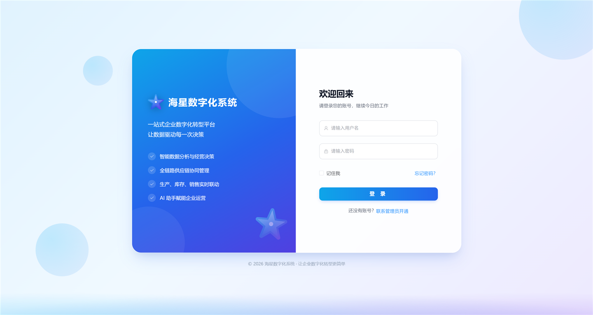
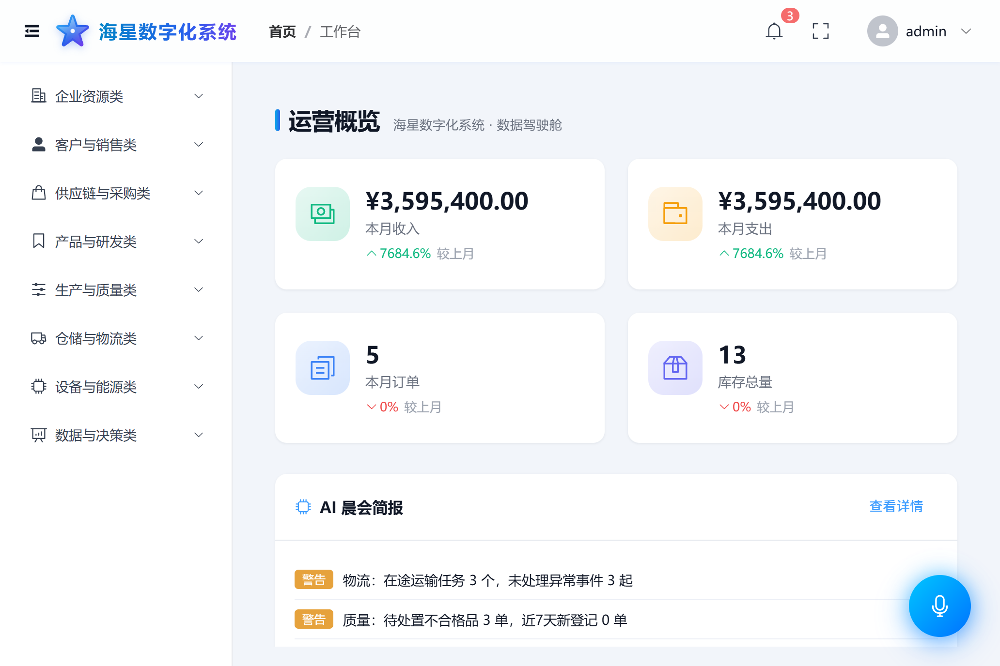
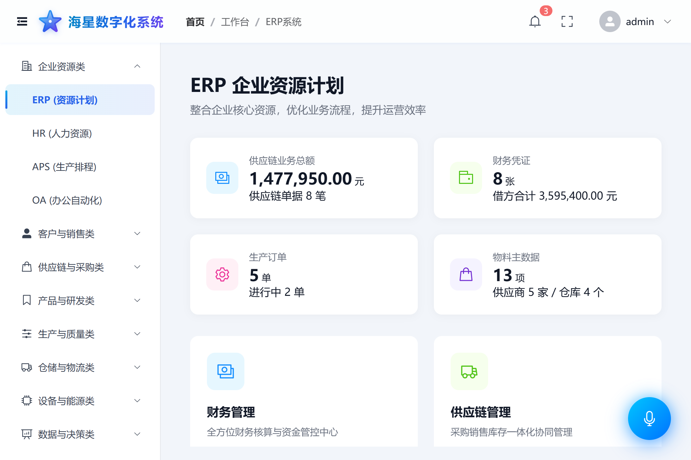
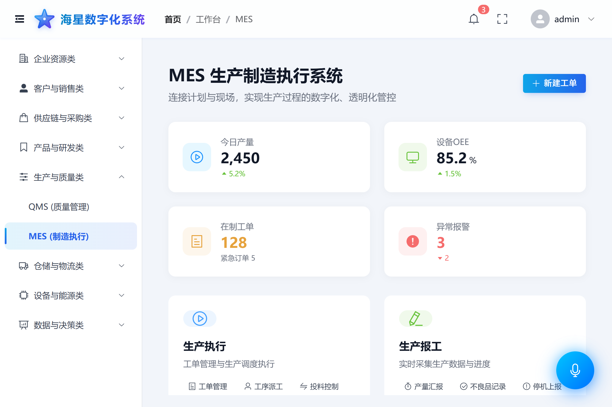
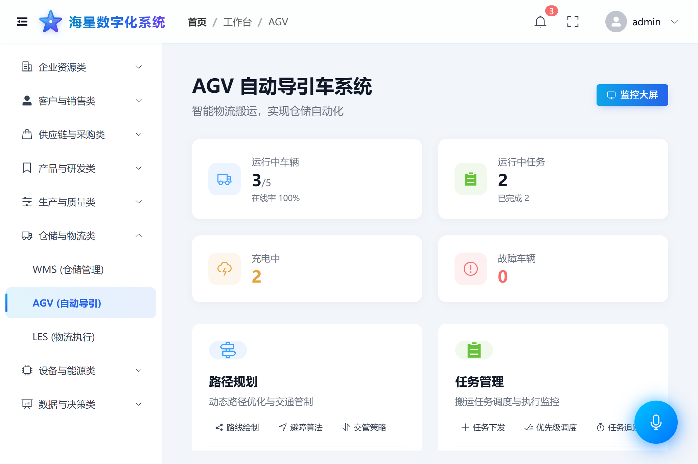

# 海星数字化系统（HAIXIN_ERP）

一站式企业数字化转型平台，覆盖企业从**销售获客 → 采购供应 → 计划生产 → 质量仓储 → 运营支撑 → 数据智能**的全业务主链路，采用 **前后端分离 + 微服务架构** 构建。

- 后端：Spring Boot + Spring Cloud（Nacos 注册发现 / Spring Cloud Gateway 网关）
- 前端：Vue 3 + Vite + Element Plus + Pinia + ECharts
- 基础设施：Docker / MySQL 8 / Redis 7 / Nacos 2.3 / Prometheus + Grafana + Loki 可观测体系

---

## 系统界面预览

| 登录页 | 工作台（运营概览） |
|:---:|:---:|
|  |  |
| **ERP 系统** | **MES 制造执行** |
|  |  |
| **AGV 调度管理** | |
|  | |

> 更多界面（CRM、SRM、WMS、QMS、APS 甘特图、供应链 3D 可视化等）可在启动系统后于左侧菜单逐模块查看。

---

## 一、系统架构

```
┌────────────────────────────────────────────────────────────┐
│                     前端 SPA（Vue3 / 端口 3000）              │
│        统一请求封装 → /api/v1/* → Vite Proxy / Nginx         │
└──────────────────────────┬─────────────────────────────────┘
                           │
┌──────────────────────────▼─────────────────────────────────┐
│              API 网关 Spring Cloud Gateway（9000）           │
│         路由转发 / 鉴权过滤 / 统一响应 / 跨域处理              │
└───────┬──────────────────────────────────┬─────────────────┘
        │ Nacos 服务发现（8848）             │
┌───────▼──────────────────────────────────▼─────────────────┐
│                     业务微服务集群（21 个）                   │
│   ERP │ CRM │ MES │ WMS │ SRM │ HR │ OA │ APS │ ...        │
└───────┬──────────────────────────────────┬─────────────────┘
        │                                  │
┌───────▼─────────┐              ┌─────────▼─────────┐
│  MySQL 8 (3307) │              │   Redis 7 (6379)  │
│  每服务独立 *_db │              │      缓存          │
└─────────────────┘              └───────────────────┘
```

## 二、核心业务链路

系统主链路按企业价值流组织，各域通过网关聚合、通过 Nacos 互相发现、通过 REST 互调：

| 链路环节 | 涉及服务 | 说明 |
|---------|---------|------|
| 1. 客户与销售 | CRM、SCRM、商机管理(opportunity) | 客户 360、社媒营销、私域运营、商机转化 |
| 2. 采购与供应 | SRM、SCM | 供应商准入/询比价/协同对账、供应链计划与 MRP |
| 3. 产品与研发 | PLM、BOM | 产品生命周期、物料清单与工程变更 |
| 4. 计划与排产 | APS、ERP | 多周期生产计划、智能排程优化、总账财务 |
| 5. 生产与质量 | MES、SCADA、QMS | 制造执行、设备数据采集监控、质量管理与 SPC 分析 |
| 6. 仓储与物流 | WMS、LES、AGV | 出入库/波次/库存可视化、物流执行、AGV 调度与 3D 监控 |
| 7. 运营支撑 | OA、HR、EAM、EMS | 审批流、人力资源、设备资产、能源管理 |
| 8. 数据与智能 | AI-Brain、AI-Voice | AI 晨会简报/决策建议、语音助手（含 ASR 模型） |

典型端到端示例（订单 → 生产 → 出库）：

```
CRM 销售订单 ──▶ ERP 需求/MRP ──▶ APS 排产 ──▶ MES 工单执行
     │                                             │
SRM 原料采购 ──▶ WMS 收货上架                MES 报工完工
                                                   │
                              WMS 出库发货 ──▶ ERP 收入核算
                                                   │
                              AI-Brain 晨会简报汇总异常与建议
```

## 三、目录结构

```
HAIXIN_ERP/
├── pom.xml                     # Maven 父工程（聚合全部模块）
├── docker-compose.yml          # 一键编排：MySQL/Nacos/Redis + 全部微服务
├── docker-compose.nacos.yml    # Nacos 单独编排
├── Dockerfile / Dockerfile.template  # 微服务通用镜像模板
├── prometheus.yml              # 监控采集配置
├── .env.example                # 环境变量模板（复制为 .env 使用）
├── src/
│   ├── common/                 # 公共组件（统一响应体/异常/工具）
│   ├── gateway/                # API 网关（9000）
│   ├── registry/               # 服务注册中心（Eureka 备选方案）
│   ├── config-center/          # 配置中心
│   └── core-services/          # 21 个业务微服务（见下表）
├── frontend/                   # Vue3 前端工程
│   ├── src/api/                # 接口封装（统一请求工具 + 按模块接口函数）
│   ├── src/views/              # 页面（erp/crm/mes/wms/agv/... 按域组织）
│   ├── src/layouts/            # 主布局（海星数字化系统品牌 UI）
│   └── public/                 # 静态资源（models/ 需另行下载）
├── docker/                     # 中间件配置与初始化 SQL
│   └── mysql/init/             # 各服务建库建表初始化脚本
├── scripts/
│   ├── download_voice_models.py        # 语音 VAD/时间戳模型下载
│   ├── download_timestamp_model.py     # 时间戳模型下载
│   └── start-frontend.cmd|.ps1         # 前端启动脚本
└── docs/
    ├── 依赖安装.md              # 环境依赖与版本要求
    ├── 模型下载.md              # AI 语音模型下载与放置说明
    └── 配置说明.md              # 配置文件与环境变量说明
```

### 业务微服务清单（src/core-services/）

| 服务 | 说明 | 服务 | 说明 |
|------|------|------|------|
| erp | 企业资源计划/财务 | mes | 制造执行 |
| crm | 客户关系管理 | wms | 仓储管理 |
| srm | 供应商关系管理 | scm | 供应链管理 |
| aps | 高级排程 | qms | 质量管理 |
| hr | 人力资源 | oa | 办公自动化 |
| plm | 产品生命周期 | bom | 物料清单 |
| les | 物流执行 | agv | AGV 调度 |
| scada | 数据采集与监控 | eam | 设备资产管理 |
| ems | 能源管理 | scrm | 社媒客户运营 |
| opportunity | 商机管理 | ai-brain | AI 决策大脑 |
| ai-voice | AI 语音助手 | | |

## 四、快速启动（Docker 一键编排，推荐）

```bash
# 1. 准备环境变量
cp .env.example .env

# 2. 构建并启动全部服务（首次构建较慢）
docker compose up -d --build

# 3. 查看健康状态（等待 mysql/nacos healthy 后业务服务依次启动）
docker compose ps
```

启动完成后：

| 入口 | 地址 |
|------|------|
| 前端页面 | http://localhost:3000 （本地 dev 模式） |
| API 网关 | http://localhost:9000 |
| Nacos 控制台 | http://localhost:8848/nacos |
| MySQL | localhost:3307 （root/root） |
| Redis | localhost:6379 |

> 默认登录账号：`admin / admin123`

## 五、前端本地开发启动

```bash
cd frontend
npm install
npm run dev        # Vite 启动于 http://localhost:3000，代理 /api → 网关 9000
```

或使用脚本：`scripts\start-frontend.cmd`

## 六、AI 语音模型（可选）

前端 AI 语音助手依赖 3 个 ASR 模型（约 1GB，**不随仓库分发**），需手动下载：

```bash
pip install modelscope
python scripts/download_voice_models.py
```

详细说明与手动下载方式见 [docs/模型下载.md](docs/模型下载.md)。

## 七、接口约定

- RESTful 风格，统一版本前缀 `/api/v1`，路径小写 + 连字符
- 统一响应体：

```json
{
  "code": 200,
  "msg": "请求成功",
  "data": {}
}
```

- 业务错误码集中定义，前端统一在请求工具中解析处理（401 跳登录、500 统一提示）

## 八、文档索引

| 文档 | 内容 |
|------|------|
| [docs/依赖安装.md](docs/依赖安装.md) | JDK/Maven/Node/Docker 等依赖与版本要求 |
| [docs/模型下载.md](docs/模型下载.md) | AI 语音模型下载、放置路径、验证方式 |
| [docs/配置说明.md](docs/配置说明.md) | .env 变量、docker-compose、Nacos 配置说明 |
